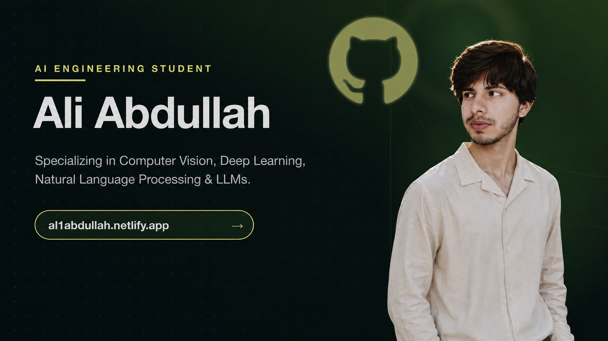
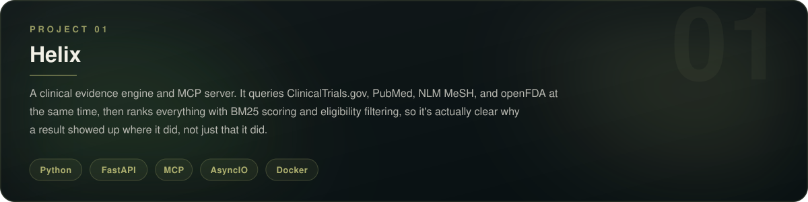
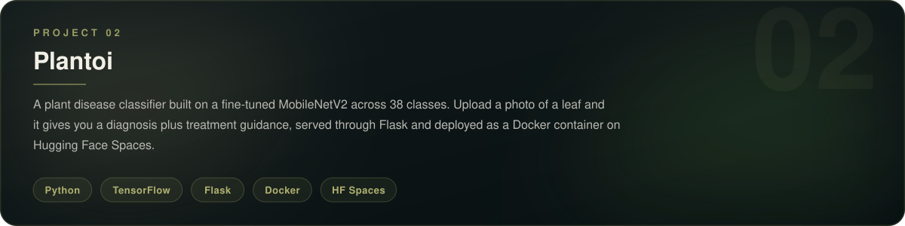
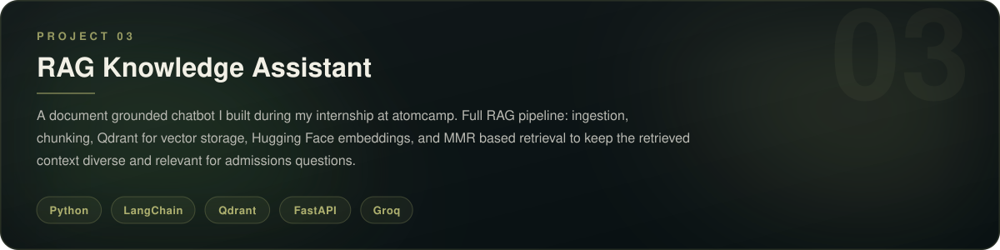
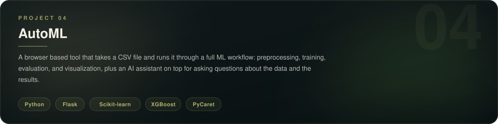

<!-- ═══════════════════════════════════════════════════════════ -->
<!--                    HEADER BANNER                          -->
<!-- ═══════════════════════════════════════════════════════════ -->

  

 

<!-- ═══════════════════════════════════════════════════════════ -->
<!--                    TYPING ANIMATION                       -->
<!-- ═══════════════════════════════════════════════════════════ -->

  

 

<!-- ═══════════════════════════════════════════════════════════ -->
<!--                    ABOUT                                  -->
<!-- ═══════════════════════════════════════════════════════════ -->

 

Most of what I build lives in the space between a trained model and something a person can actually use — data pipelines, retrieval systems, APIs, and the deployment work that turns an experiment into a running service.

Recent work centers on retrieval-augmented generation and information retrieval more broadly. Helix, a clinical evidence engine, queries ClinicalTrials.gov, PubMed, NLM MeSH, and openFDA in parallel, then scores and ranks the combined results using BM25 and eligibility filtering — making it clear *why* a result was ranked where it was, not just *that* it was. Other work spans computer vision, including a plant disease classifier built on a fine-tuned MobileNetV2, and tooling that wraps common ML workflows into something usable from a browser.

In mid-2025, I worked as an AI Intern at atomcamp, building a RAG-based knowledge assistant over the company's program and admissions data, alongside an AutoML tool for CSV-based workflows — both deployed on Hugging Face Spaces.

 

<!-- ═══════════════════════════════════════════════════════════ -->
<!--                    CURRENTLY                              -->
<!-- ═══════════════════════════════════════════════════════════ -->

 

- Studying AI Engineering at SZABIST, Islamabad — expected 2027
- Building Helix, an MCP-compatible clinical evidence retrieval engine
- Open to AI/ML internships in Islamabad, on-site preferred

 

<!-- ═══════════════════════════════════════════════════════════ -->
<!--                    FEATURED PROJECTS                      -->
<!-- ═══════════════════════════════════════════════════════════ -->

 

<table width="100%">
<tr>
<td width="50%">

</td>
<td width="50%">

</td>
</tr>
<tr>
<td width="50%">

</td>
<td width="50%">

</td>
</tr>
</table>

 

<!-- ═══════════════════════════════════════════════════════════ -->
<!--                    GITHUB ACTIVITY                        -->
<!-- ═══════════════════════════════════════════════════════════ -->

 

  
  &nbsp;&nbsp;
  

 

  

 

  

 

<!-- ═══════════════════════════════════════════════════════════ -->
<!--                    TECH STACK                             -->
<!-- ═══════════════════════════════════════════════════════════ -->

 

**Languages**

 

**AI &amp; ML**

 

**Infrastructure &amp; Tools**

 

<!-- ═══════════════════════════════════════════════════════════ -->
<!--                    BACKGROUND                             -->
<!-- ═══════════════════════════════════════════════════════════ -->

 

**Education**
SZABIST University, Islamabad
Bachelor's degree, AI Engineering — 2023 to 2027
Coursework centered on machine learning and applied computing, with an emphasis on turning concepts into working implementations through projects and structured assignments.

**Experience**
AI Intern, atomcamp — June 2025 to August 2025, Islamabad
Built a RAG-based knowledge assistant and an AutoML tool for CSV-based workflows, both deployed on Hugging Face Spaces, and worked on prompt engineering to keep model outputs structured and consistent.

 

<!-- ═══════════════════════════════════════════════════════════ -->
<!--                    SNAKE ANIMATION                        -->
<!-- ═══════════════════════════════════════════════════════════ -->

  <picture>
    <source media="(prefers-color-scheme: dark)"
            srcset="https://raw.githubusercontent.com/Al1Abdullah/Al1Abdullah/output/github-contribution-grid-snake-dark.svg"/>
    <source media="(prefers-color-scheme: light)"
            srcset="https://raw.githubusercontent.com/Al1Abdullah/Al1Abdullah/output/github-contribution-grid-snake.svg"/>
    
  </picture>

 

<!-- ═══════════════════════════════════════════════════════════ -->
<!--                    CONNECT / FOOTER                       -->
<!-- ═══════════════════════════════════════════════════════════ -->

 

  

