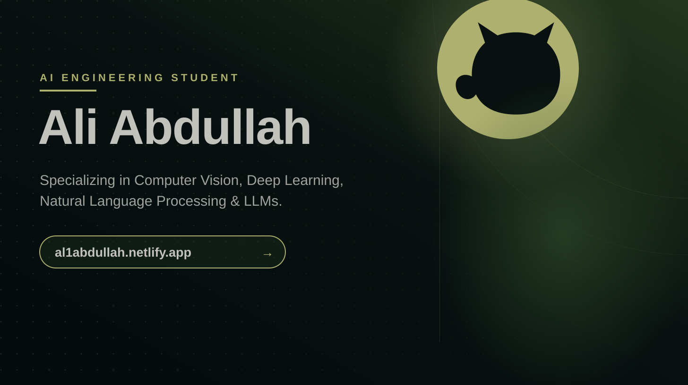

<!-- ═══════════════════════════════════════════════════════════ -->
<!--                    HEADER BANNER                          -->
<!-- ═══════════════════════════════════════════════════════════ -->

  

 

<!-- ═══════════════════════════════════════════════════════════ -->
<!--                    TYPING ANIMATION                       -->
<!-- ═══════════════════════════════════════════════════════════ -->

  

 

<!-- ═══════════════════════════════════════════════════════════ -->
<!--                    GITHUB STATS                           -->
<!-- ═══════════════════════════════════════════════════════════ -->

  
  &nbsp;&nbsp;
  

 

<!-- ═══════════════════════════════════════════════════════════ -->
<!--                    STREAK STATS                           -->
<!-- ═══════════════════════════════════════════════════════════ -->

  

 

<!-- ═══════════════════════════════════════════════════════════ -->
<!--                    TECH STACK                             -->
<!-- ═══════════════════════════════════════════════════════════ -->

### 🛠 &nbsp;Tech Stack

 

<!-- ═══════════════════════════════════════════════════════════ -->
<!--                    ACTIVITY GRAPH                         -->
<!-- ═══════════════════════════════════════════════════════════ -->

  

 

<!-- ═══════════════════════════════════════════════════════════ -->
<!--                    SNAKE ANIMATION                        -->
<!-- ═══════════════════════════════════════════════════════════ -->

  <picture>
    <source media="(prefers-color-scheme: dark)"
            srcset="https://raw.githubusercontent.com/Al1Abdullah/Al1Abdullah/output/github-contribution-grid-snake-dark.svg"/>
    <source media="(prefers-color-scheme: light)"
            srcset="https://raw.githubusercontent.com/Al1Abdullah/Al1Abdullah/output/github-contribution-grid-snake.svg"/>
    
  </picture>

<!-- ═══════════════════════════════════════════════════════════ -->
<!--                    FOOTER                                 -->
<!-- ═══════════════════════════════════════════════════════════ -->
 

  

